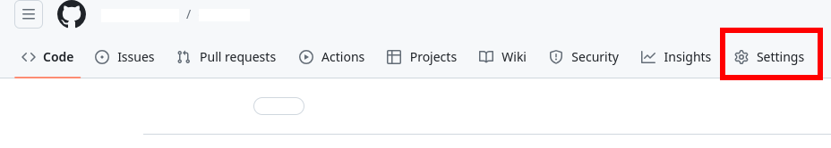
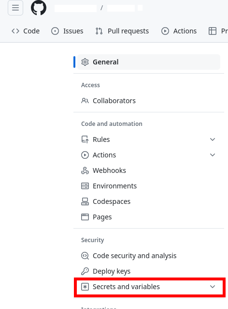
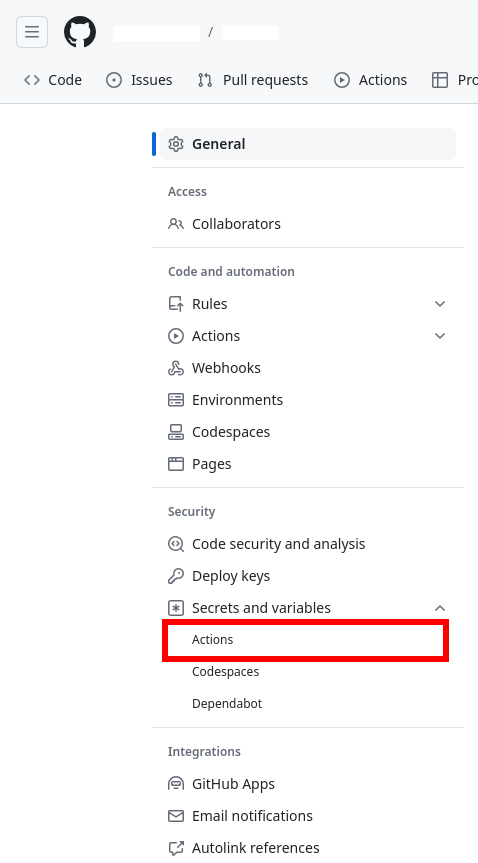
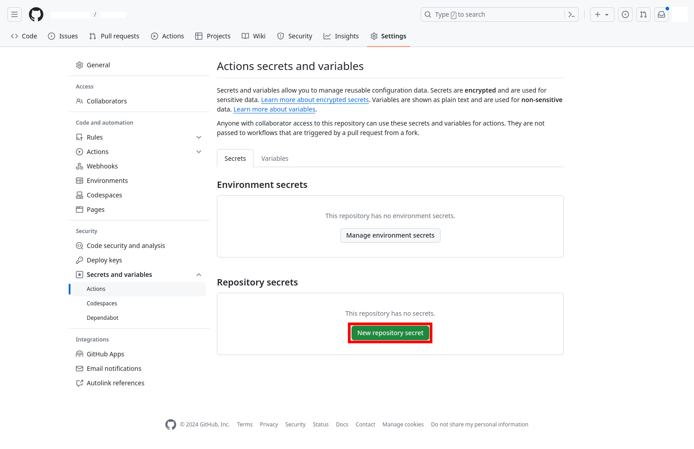
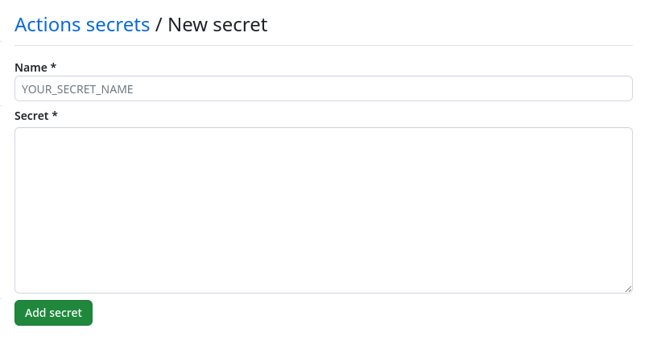

# Laboratório de Deploy automático com GitHub Actions

Elaboração de um workflow de deploy no GitHub

## Tecnologias utilizadas

<div style="display: flex; gap: 10px;">
    
    
    
    
</div>

## Onde Aplicar
Este projeto pode ser aplicado em diversas situações:
- Quando temos um servidor que pode ser acessado por SSH pela internet.
- E temos um repositório no GitHub que queremos que esteja sempre sincronizado com o servidor.

## Roadmap

### STEP 1 - Criar o workflow do GitHub Actions

1. **Na pasta do seu repositório Git, (caso não exista) crie a pasta ".github" (com ponto).**
2. **Dentro da pasta ".github", (caso não exista) crie a pasta "workflows".**
3. **Dentro da pasta "workflows", crie um arquivo com a extensão ".yml" com o nome que você desejar.**
4. **Abra o arquivo criado no editor de texto de sua preferência.**

### STEP 2 - Editando o workflow

No editor de texto de sua preferência, edite o arquivo com extensão .yml criado:

1. **Adicione o nome da sua workflow**

```
name: Deploy automático para o servidor
```

2. **Adicione as variáveis de ambiente**

```
name: Deploy automático para o servidor

env:
    hostname:
    username:
    destination:
```

Essas variáveis ficarão em branco por enquanto.

3. **Adicione os eventos os quais a workflow deverá ser executada**

```
name: Deploy automático para o servidor

env:
    hostname:
    username:
    destination:
    
on:
    push:
        branches:
            - main
    pull_request:
        branches:
            - main
        types:
            - closed
```

Neste exemplo, a workflow será executada quando houver um _push_ na _branch_ main ou ela sofrer um _merge_ por meio de um _pull request_.

4. **Adicione o campo jobs**

```
name: Deploy automático para o servidor

env:
    hostname:
    username:
    destination:
    
on:
    push:
        branches:
            - main
    pull_request:
        branches:
            - main
        types:
            - closed
            
jobs:
    deploy:
```

5. **Adicione a máquina virtual que deseja utilizar**

```
name: Deploy automático para o servidor

env:
    hostname:
    username:
    destination:
    
on:
    push:
        branches:
            - main
    pull_request:
        branches:
            - main
        types:
            - closed
            
jobs:
    deploy:
        runs-on: ubuntu-latest
```

Neste exemplo a máquina virtual escolhida foi a última versão do Ubuntu. O GitHub oferece as [seguintes opções de máquinas virtuais](https://docs.github.com/en/actions/using-jobs/choosing-the-runner-for-a-job#choosing-github-hosted-runners).

6. **Adicione os passos a serem executados**

```
name: Deploy automático para o servidor

env:
    hostname:
    username:
    destination:
    
on:
    push:
        branches:
            - main
    pull_request:
        branches:
            - main
        types:
            - closed
            
jobs:
    deploy:
        runs-on: ubuntu-latest
        steps:
```

7. **Baixe o código do repositório**

```
name: Deploy automático para o servidor

env:
    hostname:
    username:
    destination:
    
on:
    push:
        branches:
            - main
    pull_request:
        branches:
            - main
        types:
            - closed
            
jobs:
    deploy:
        runs-on: ubuntu-latest
        steps:
            - uses: actions/checkout@v4
```

A linha ```- uses: actions/checkout@v4``` obtém o código do repositório no GitHub que contém esta GitHub Actions workflow.

8. **Instale os pacotes necessários**

```
name: Deploy automático para o servidor

env:
    hostname:
    username:
    destination:
    
on:
    push:
        branches:
            - main
    pull_request:
        branches:
            - main
        types:
            - closed
            
jobs:
    deploy:
        runs-on: ubuntu-latest
        steps:
            - uses: actions/checkout@v4
            - run: sudo apt update
            - run: sudo apt install -y rsync
            - run: sudo apt install -y openssh-client
            - run: sudo apt install -y secure-delete
            - run: sudo apt install -y sshpass
```

O ```-run: ``` dentro de ```steps:```, permite a execução de comandos na máquina virtual escolhida.   

A linha ```- run: sudo apt update``` faz o gerenciador de pacotes APT do Ubuntu obter informações dos pacotes disponíveis para serem instalados.

A linha ```- run: sudo apt install -y rsync``` instala o pacote rsync, que será utilizado para sincronizar os arquivos e pastas do repositório no GitHub com o servidor.

A linha ```- run: sudo apt install -y openssh-client``` instala o pacote openssh-client, que será utilizado para conectar com o servidor por meio do ssh para o envio de arquivos.

A linha ```- run: sudo apt install -y secure-delete``` instala o pacote secure-delete, que será utilizado para instalar o comando srm que será utilizado para apagar a chave privada ssh, quando ela não for mais utilizada.

A linha ```- run: sudo apt install -y sshpass``` instala o pacote sshpass, que será utilizado para passar a senha ssh para sincronizar arquivos por meio do rsync sobre o ssh.

Para mais informações de como executar a instalação de pacotes no Ubuntu, verifique a [documentação oficial](https://manpages.ubuntu.com/manpages/xenial/man8/apt.8.html).

9. **Obtenha a chave ssh privada**

```
name: Deploy automático para o servidor

env:
    hostname:
    username:
    destination:
    
on:
    push:
        branches:
            - main
    pull_request:
        branches:
            - main
        types:
            - closed
            
jobs:
    deploy:
        runs-on: ubuntu-latest
        steps:
            - uses: actions/checkout@v4
            - run: sudo apt update
            - run: sudo apt install -y rsync
            - run: sudo apt install -y openssh-client
            - run: sudo apt install -y secure-delete
            - run: sudo apt install -y sshpass
            - run: mkdir -p ~/.ssh
            - run: echo "${{secrets.SSH_PRIVATE_KEY}}" > ~/.ssh/id_rsa
            - run: chmod 600 ~/.ssh/id_rsa
```

A linha ```- run: mkdir -p ~/.ssh``` cria a pasta ".ssh" dentro da pasta do usuário, na máquina virtual do GitHub Actions. Nessa pasta ficará salva a chave ssh privada, que será utilizada para transferir arquivos para o servidor.

A linha ```- run: echo "${{secrets.SSH_PRIVATE_KEY}}" > ~/.ssh/id_rsa``` escreve a chave ssh privada no arquivo "id_rsa" dentro da pasta ".ssh" recém criada.

A linha ```- run: chmod 600 ~/.ssh/id_rsa``` altera as permissões do arquivo "id_rsa" para permitir somente a leitura e escrita do usuário dono, retirando as permissões do grupo e dos outros usuários. [Mais informações sobre o comando chmod](https://pt.wikipedia.org/wiki/Chmod#:~:text=n%C3%A3o%20possuem%20permiss%C3%B5es.-,Permiss%C3%B5es%20num%C3%A9ricas,-O%20formato%20num%C3%A9rico).

10. **Sincronizando arquivos com o servidor**

```
name: Deploy automático para o servidor

env:
    hostname:
    username:
    destination:
    
on:
    push:
        branches:
            - main
    pull_request:
        branches:
            - main
        types:
            - closed
            
jobs:
    deploy:
        runs-on: ubuntu-latest
        steps:
            - uses: actions/checkout@v4
            - run: sudo apt update
            - run: sudo apt install -y rsync
            - run: sudo apt install -y openssh-client
            - run: sudo apt install -y secure-delete
            - run: sudo apt install -y sshpass
            - run: mkdir -p ~/.ssh
            - run: echo "${{secrets.SSH_PRIVATE_KEY}}" > ~/.ssh/id_rsa
            - run: chmod 600 ~/.ssh/id_rsa
            - run: rsync -p ${{secrets.SERVER_PASSWORD}} --archive --verbose --compress --delete -e "ssh -o StrictHostKeyChecking=no -i ~/.ssh/id_rsa" ./ ${{env.username}}@${{env.hostname}}:${{env.destination}}
              continue-on-error: true
```

A linha ```rsync -p ${{secrets.SERVER_PASSWORD}} --archive --verbose --compress --delete -e "ssh -o StrictHostKeyChecking=no -i ~/.ssh/id_rsa" ./ ${{env.username}}@${{env.hostname}}:${{env.destination}}``` realiza a sincronização de arquivos entre a pasta atual da máquina virtual do GitHub Actions e o servidor.

A opção ```-p``` passa a senha do usuário ssh do servidor.

A opção ```--verbose``` coloca o rsync no modo verboso, imprimindo o nome dos arquivos a medida que eles são enviados para o servidor, além de outras informações.

A opção ```--compress``` realiza a compressão dados durante o envio.

A opção ```--delete``` apaga os arquivos que estão no destino, mas não estão na origem.

A opção ```-e``` especifica o shell remoto a ser utilizado, permitindo passar argumentos para ele.

A opção ```-o``` do comando ssh especifica as opções a serem utilizadas no comando ssh.

O ```StrictHostKeyChecking=no``` especifica para o ssh não verificar a chave pública do host.

A opção ```-i``` do comando ssh especifica a chave privada a ser utilizada.

O ```${{env.username}}``` obtém do .yml o valor da variável username de env.

O ```${{env.hostname}}``` obtém do .yml o valor da variável hostname de env.

O ```./``` é a pasta de origem.

E o ```${{env.username}}@${{env.hostname}}:${{env.destination}}``` é o nome de usuário, hostname e a pasta de destino. O "@" e ":" separam esses elementos.

A ordem da pasta de origem e da pasta de destino importam.

Para mais informações sobre o comando rsync, acesse a [documentação oficial](https://linux.die.net/man/1/rsync).

E a linha ```continue-on-error: true``` ignora eventuais erros de sincronização com o servidor, permitindo executar os próximos comandos.

11. **Apagando a chave ssh privada**

```
name: Deploy automático para o servidor

env:
    hostname:
    username:
    destination:
    
on:
    push:
        branches:
            - main
    pull_request:
        branches:
            - main
        types:
            - closed
            
jobs:
    deploy:
        runs-on: ubuntu-latest
        steps:
            - uses: actions/checkout@v4
            - run: sudo apt update
            - run: sudo apt install -y rsync
            - run: sudo apt install -y openssh-client
            - run: sudo apt install -y secure-delete
            - run: sudo apt install -y sshpass
            - run: mkdir -p ~/.ssh
            - run: echo "${{secrets.SSH_PRIVATE_KEY}}" > ~/.ssh/id_rsa
            - run: chmod 600 ~/.ssh/id_rsa
            - run: rsync -p ${{secrets.SERVER_PASSWORD}} --archive --verbose --compress --delete -e "ssh -o StrictHostKeyChecking=no -i ~/.ssh/id_rsa" ./ ${{env.username}}@${{env.hostname}}:${{env.destination}}
              continue-on-error: true
            - run: srm ~/.ssh/id_rsa
```

A linha ```- run: srm ~/.ssh/id_rsa``` apaga fisicamente a chave ssh privada da máquina virtual do GitHub Actions.

12. **Corrigindo erros de permissão durante a cópia dos arquivos**

Durante a sincronização dos arquivos da máquina virtual do GitHub Actions e o servidor, pode ser que alguns arquivos não tenham sido copiados pelo fato do usuário que está realizando essa cópia não ter permissões.

Para solucionar esse problema, vamos modificar a workflow do GitHub Actions para alterar essas permissões antes de copiar os arquivos.

```
name: Deploy automático para o servidor

env:
    hostname:
    username:
    destination:
    
on:
    push:
        branches:
            - main
    pull_request:
        branches:
            - main
        types:
            - closed
            
jobs:
    deploy:
        runs-on: ubuntu-latest
        steps:
            - uses: actions/checkout@v4
            - run: sudo apt update
            - run: sudo apt install -y rsync
            - run: sudo apt install -y openssh-client
            - run: sudo apt install -y secure-delete
            - run: sudo apt install -y sshpass
            - run: mkdir -p ~/.ssh
            - run: echo "${{secrets.SSH_PRIVATE_KEY}}" > ~/.ssh/id_rsa
            - run: chmod 600 ~/.ssh/id_rsa
            - run: sshpass -p "${{secrets.SERVER_PASSWORD}}" ssh -o StrictHostKeyChecking=no -i ~/.ssh/id_rsa ${{env.username}}@${{env.hostname}} "echo \"${{secrets.SERVER_PASSWORD}}\" | sudo -S chown --recursive ${{env.username}} ${{env.destination}}"
            - run: rsync -p ${{secrets.SERVER_PASSWORD}} --archive --verbose --compress --delete -e "ssh -o StrictHostKeyChecking=no -i ~/.ssh/id_rsa" ./ ${{env.username}}@${{env.hostname}}:${{env.destination}}
              continue-on-error: true
            - run: srm ~/.ssh/id_rsa
```

A linha ```- run: sshpass -p "${{secrets.SERVER_PASSWORD}}" ssh -o StrictHostKeyChecking=no -i ~/.ssh/id_rsa ${{env.username}}@${{env.hostname}} "echo \"${{secrets.SERVER_PASSWORD}}\" | sudo -S chown --recursive ${{env.username}} ${{env.destination}}"``` acessa remotamente o servidor, por meio do ssh e executa o comando chown como root.

O comando ```sshpass``` é utilizado para passar a senha por linha de comando ao ssh.

A opção ```-p``` passa a senha do usuário ssh do servidor.

O comando ```ssh``` é utilizado para acessar remotamente o shell do servidor.

A opção ```-o``` do comando ssh especifica as opções a serem utilizadas no comando ssh.

O ```StrictHostKeyChecking=no``` especifica para o ssh não verificar a chave pública do host.

A opção ```-i``` do comando ssh especifica a chave privada a ser utilizada.

O ```${{env.username}}``` obtém do .yml o valor da variável username de env.

O ```${{env.hostname}}``` obtém do .yml o valor da variável hostname de env.

O comando ```echo``` está sendo utilizado para passar a senha do usuário atual ao comando ```sudo```.

O ```\"${{secrets.SERVER_PASSWORD}}\"``` entrega ao echo a senha do usuário do servidor, que será enviado ao comando ```sudo```

O comando ```sudo``` realiza a elevação de privilégios para root.

A opção ```-S``` do ```sudo``` realiza a leitura da senha da entrada padrão, que neste caso virá do comando ```echo```.

O comando ```chown``` é utilizado para alterar o usuário dono do arquivo.

A opção ```--recursive``` do ```chown``` realiza a troca do dono para todas as pastas e arquivos dentro da pasta especificada.

O ```${{env.username}}"``` especifica o novo dono dos arquivos.

O ``` ${{env.destination}}``` especifica a localização da pasta cujo usuário dono será alterado (neste caso, inclusive para as pastas e os arquivos filhos)

13. **Corrigindo erro de permissão depois da cópia**

Dependendo da aplicação que vai utilizar esses arquivos, pode ser que seja necessário que o usuário dono desses arquivos, seja outro.

Para solucionar esse problema, vamos modificar a workflow do GitHub Actions para alterar novamente essas permissões.

```
name: Deploy automático para o servidor

env:
    hostname:
    username:
    destination:
    target_username:
    target_group:
    
on:
    push:
        branches:
            - main
    pull_request:
        branches:
            - main
        types:
            - closed
            
jobs:
    deploy:
        runs-on: ubuntu-latest
        steps:
            - uses: actions/checkout@v4
            - run: sudo apt update
            - run: sudo apt install -y rsync
            - run: sudo apt install -y openssh-client
            - run: sudo apt install -y secure-delete
            - run: sudo apt install -y sshpass
            - run: mkdir -p ~/.ssh
            - run: echo "${{secrets.SSH_PRIVATE_KEY}}" > ~/.ssh/id_rsa
            - run: chmod 600 ~/.ssh/id_rsa
            - run: sshpass -p "${{secrets.SERVER_PASSWORD}}" ssh -o StrictHostKeyChecking=no -i ~/.ssh/id_rsa ${{env.username}}@${{env.hostname}} "echo \"${{secrets.SERVER_PASSWORD}}\" | sudo -S chown --recursive ${{env.username}} ${{env.destination}}"
            - run: rsync -p ${{secrets.SERVER_PASSWORD}} --archive --verbose --compress --delete -e "ssh -o StrictHostKeyChecking=no -i ~/.ssh/id_rsa" ./ ${{env.username}}@${{env.hostname}}:${{env.destination}}
              continue-on-error: true
            - run: sshpass -p "${{secrets.SERVER_PASSWORD}}" ssh -o StrictHostKeyChecking=no -i ~/.ssh/id_rsa ${{env.username}}@${{env.hostname}} "echo \"${{secrets.SERVER_PASSWORD}}\" | sudo -S chown --recursive ${{env.target_username}}:${{env.target_group}} ${{env.destination}}"
            - run: srm ~/.ssh/id_rsa
```

A linha ```- run: sshpass -p "${{secrets.SERVER_PASSWORD}}" ssh -o StrictHostKeyChecking=no -i ~/.ssh/id_rsa ${{env.username}}@${{env.hostname}} "echo \"${{secrets.SERVER_PASSWORD}}\" | sudo -S chown --recursive ${{env.target_username}}:${{env.target_group}} ${{env.destination}}"``` acessa remotamente o servidor, por meio do ssh e executa o comando chown como root.

O comando ```sshpass``` é utilizado para passar a senha por linha de comando ao ssh.

A opção ```-p``` passa a senha do usuário ssh do servidor.

O comando ```ssh``` é utilizado para acessar remotamente o shell do servidor.

A opção ```-o``` do comando ssh especifica as opções a serem utilizadas no comando ssh.

O ```StrictHostKeyChecking=no``` especifica para o ssh não verificar a chave pública do host.

A opção ```-i``` do comando ssh especifica a chave privada a ser utilizada.

O ```${{env.username}}``` obtém do .yml o valor da variável username de env.

O ```${{env.hostname}}``` obtém do .yml o valor da variável hostname de env.

O comando ```echo``` está sendo utilizado para passar a senha do usuário atual ao comando ```sudo```.

O ```\"${{secrets.SERVER_PASSWORD}}\"``` entrega ao echo a senha do usuário do servidor, que será enviado ao comando ```sudo```

O comando ```sudo``` realiza a elevação de privilégios para root.

A opção ```-S``` do ```sudo``` realiza a leitura da senha da entrada padrão, que neste caso virá do comando ```echo```.

O comando ```chown``` é utilizado para alterar o usuário dono do arquivo.

A opção ```--recursive``` do ```chown``` realiza a troca do dono para todas as pastas e arquivos dentro da pasta especificada.

O ```${{env.target_username}}``` especifica o novo dono dos arquivos.

O ```${{env.target_group}}``` especifica o grupo dono dos arquivos.

O ``` ${{env.destination}}``` especifica a localização da pasta cujo usuário dono será alterado (neste caso, inclusive para as pastas e os arquivos filhos)

16. **Ignorando pastas e arquivos**

Em algumas situações, não é desejável que todos os arquivos sejam sincronizados com o servidor. Por exemplo, as pastas ".git", ".github" e ".vscode" podem ser ignoradas.

Para solucionar esse problema, vamos modificar a workflow do GitHub Actions para ignorar esses arquivos.

```
name: Deploy automático para o servidor

env:
    hostname:
    username:
    destination:
    target_username:
    target_group:
    excluded_items_command: "--exclude .git --exclude .github --exclude .vscode"
    
on:
    push:
        branches:
            - main
    pull_request:
        branches:
            - main
        types:
            - closed
            
jobs:
    deploy:
        runs-on: ubuntu-latest
        steps:
            - uses: actions/checkout@v4
            - run: sudo apt update
            - run: sudo apt install -y rsync
            - run: sudo apt install -y openssh-client
            - run: sudo apt install -y secure-delete
            - run: sudo apt install -y sshpass
            - run: mkdir -p ~/.ssh
            - run: echo "${{secrets.SSH_PRIVATE_KEY}}" > ~/.ssh/id_rsa
            - run: chmod 600 ~/.ssh/id_rsa
            - run: sshpass -p "${{secrets.SERVER_PASSWORD}}" ssh -o StrictHostKeyChecking=no -i ~/.ssh/id_rsa ${{env.username}}@${{env.hostname}} "echo \"${{secrets.SERVER_PASSWORD}}\" | sudo -S chown --recursive ${{env.username}} ${{env.destination}}"
            - run: rsync -p ${{secrets.SERVER_PASSWORD}} --archive --verbose --compress --delete ${{env.excluded_items_command}} -e "ssh -o StrictHostKeyChecking=no -i ~/.ssh/id_rsa" ./ ${{env.username}}@${{env.hostname}}:${{env.destination}}
              continue-on-error: true
            - run: sshpass -p "${{secrets.SERVER_PASSWORD}}" ssh -o StrictHostKeyChecking=no -i ~/.ssh/id_rsa ${{env.username}}@${{env.hostname}} "echo \"${{secrets.SERVER_PASSWORD}}\" | sudo -S chown --recursive ${{env.target_username}}:${{env.target_group}} ${{env.destination}}"
            - run: srm ~/.ssh/id_rsa
```

A opção ```--exclude``` do comando rsync excluí um arquivo ou pasta. Ela deve ser repetida para cada arquivo ou pasta que se deseja excluir.

17. **Adicionando chave ssh privada ao repositório do GitHub.**

Na página do repositório do GitHub (o qual esteja localizado a workflow do GitHub actions), clique em "**Settings**".



Clique em "**Secrets and Variables**", da seção "**Security**"



e depois em "**Actions**",



e em "**Repository secrets**", clique em "**New repository secret**".



Em "**Name**" coloque ```SSH_PRIVATE_KEY```, e em "**Secret**" cole a chave ssh privada.

E clique em "**Add secret**".

